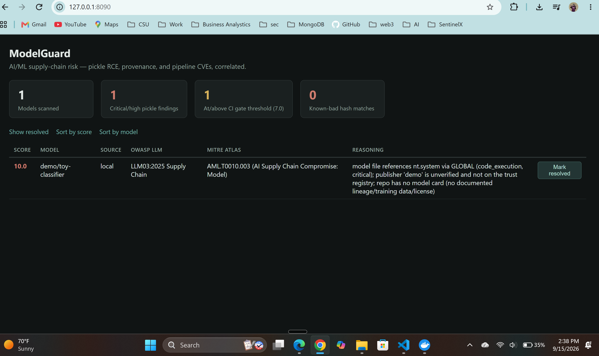
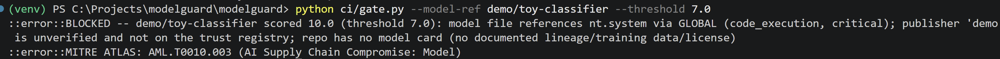
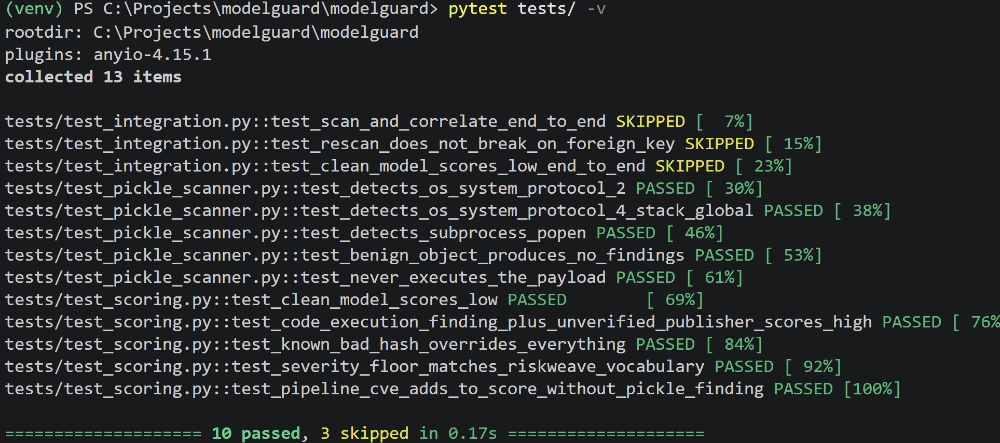

# ModelGuard

**An AI/ML supply-chain risk scanner — RiskWeave's correlation engine, applied to model artifacts.**

> Status: early / active development. Pickle opcode scanning, provenance
> checks, the correlation/scoring engine, CLI, dashboard, and CI gate are
> working end to end against local fixtures (see [the demo](demo/DEMO_WALKTHROUGH.md)).
> Live Hugging Face Hub scanning and pipeline CVE correlation use the same
> code paths as [RiskWeave](https://github.com/LokeshSivaprakash/riskweave)'s
> Syft/Grype ingestion but haven't yet been run against a real production
> pipeline. See [Roadmap](#roadmap) for what's real today vs. planned.

## The problem

Model files loaded via Python's `pickle` protocol — `.pt`, `.pth`, legacy
`.bin`, `.ckpt` — can embed arbitrary code that runs on deserialization.
`pickle.load()` doesn't just reconstruct data; its `GLOBAL`/`REDUCE` opcodes
can reference and call *any* importable callable with attacker-controlled
arguments. Pulling a model from a public hub and loading it is functionally
similar to running an installer you didn't audit.

MITRE ATLAS names this directly as **AML.T0010 — AI Supply Chain
Compromise** (sub-technique **AML.T0010.003 — Model**), and OWASP's Top 10
for LLM Applications (2025) covers it under **LLM03:2025 — Supply Chain**.
Almost no mid-size company has tooling for this today — most either trust
the hub's own scanning or don't check at all.

## What it does

1. **Classifies and scans** every weight file in a model directory —
   `safetensors` files are safe by construction and skipped; pickle-based
   formats (`.pt`/`.pth`/`.bin`/`.ckpt`/`.pkl`) are statically disassembled
   with `pickletools.genops` and checked for dangerous callables
   (`os.system`, `subprocess.Popen`, `eval`, `socket.socket`, ...). The file
   is never unpickled or executed — see
   [`ingestion/pickle_scanner.py`](ingestion/pickle_scanner.py) for why that
   distinction is the whole safety property.
2. **Checks provenance** — publisher verification and model-card presence
   via the Hugging Face Hub API, cross-referenced against a local trust
   registry of vetted publishers and known-bad file hashes.
3. **Correlates the ML pipeline's own dependencies** — the environment that
   will *load* the model, scanned with the same Syft/Grype pipeline RiskWeave
   uses for container images, so a vulnerable `torch`/`transformers` version
   in the loader is scored alongside the model file itself.
4. **Scores and explains** each model — not just "this pickle has a
   suspicious opcode," but a correlated risk score (unsafe serialization +
   unverified provenance + a vulnerable loader is a very different finding
   than any one of those alone), plus an AI-generated plain-English
   narrative and remediation plan.
5. **Enforces the worst findings in CI** via a pre-deployment gate script
   that fails the build above a configurable risk threshold — the same
   "block, don't just alert" pattern as RiskWeave's Kyverno admission policy,
   adapted to a CI job since there's no equivalent admission controller for
   "a model about to be loaded."
6. **Exports an AI Bill of Materials (AIBOM)** — a machine-readable record of
   every file, finding, and provenance check for a model, in JSON.

ModelGuard deliberately does **not** reimplement general vulnerability
scanning — Syft and Grype already do that well. It's the same correlation
and prioritization layer RiskWeave applies to Kubernetes, applied here to
AI/ML artifacts instead.

## Architecture

```
 Model weight files ──► pickle_scanner.py (opcode disassembly, never executed)
 HF Hub API / trust ──► fetch_provenance.py                                    │
   registry                                                                    ▼
 ML pipeline SBOM ────► Syft/Grype (reused from RiskWeave) ──► Postgres (schema.sql)
   + CVEs                                                              │
                                                                        ▼
                                                          correlation/aibom_risk.py
                                                                        │
                                              ┌─────────────────────────┴────────────────────────┐
                                              ▼                                                    ▼
                                AI narrative (OpenAI API)                          CI gate (fail build on threshold)
```

## Quick start (CLI)

```bash
git clone <this repo>
cd modelguard
cp .env.example .env   # fill in OPENAI_API_KEY if you want narratives
docker compose up -d   # starts Postgres

pip install -r requirements.txt
python cli.py init-db  # applies schema.sql

python cli.py scan-model --model-ref org/model-name --path ./local/snapshot --source local
python cli.py check-provenance --model-ref org/model-name --source huggingface
python cli.py scan-pipeline --pipeline-ref inference-service:latest   # needs syft + grype
python cli.py correlate    # runs the correlation engine, prints top risks
python cli.py narrate --limit 5     # AI narratives (needs OPENAI_API_KEY)
python cli.py report                # re-print current findings anytime
python cli.py aibom --model-ref org/model-name --out model.aibom.json
python cli.py dashboard              # launches the web dashboard at localhost:5060
```

No model on hand? Run the self-contained demo instead:
[`demo/DEMO_WALKTHROUGH.md`](demo/DEMO_WALKTHROUGH.md) — 5 minutes, no
Hugging Face account needed, builds its own synthetic fixtures.

## CI gate

```bash
python ci/gate.py --model-ref org/model-name --threshold 7.0
```

Exits `1` and prints the correlated reasoning if the model's risk score is at
or above the threshold — wire this into the same pipeline stage that runs
your existing SAST gate. See
[`.github/workflows/scan.yml`](.github/workflows/scan.yml) for a working
GitHub Actions example.

## Scoring philosophy

Same as RiskWeave's: severity of an individual finding sets a low floor;
*correlation* is what earns a high score. A pickle file that references
`os.system` from a well-known, verified publisher with a documented model
card is a very different risk than the same finding from an unverified,
undocumented repo — the second one is what actually gets flagged for CI
blocking. Weights are transparent and documented inline in
[`correlation/aibom_risk.py`](correlation/aibom_risk.py), meant to be argued
with and tuned against real findings, not treated as ground truth.

## Web dashboard

```bash
python cli.py dashboard
# open http://127.0.0.1:5060
```

Server-rendered Flask + Jinja, no build step — same choice RiskWeave's
dashboard makes, for the same reason: the point of this project is the
correlation logic, not the frontend.

## Limitations (stated honestly, not glossed over)

- The pickle opcode scanner is a static, single-pass disassembly. A
  sufficiently determined adversary could interleave `MEMOIZE`/`PUT`-based
  indirection to evade the two-slot `STACK_GLOBAL` pairing used here — a
  limitation shared by every static pickle scanner, including production
  tools like `fickling` and `picklescan`. It's a reason to pair static
  scanning with provenance checks, not a substitute for them.
- `.onnx`, `.gguf`, and `.h5`/Keras formats are classified but not deep-scanned
  in this MVP — ONNX and GGUF are lower-risk by format (not pickle-based);
  Keras `Lambda` layers are a real, different code-execution vector that
  needs its own scanner (tracked in the roadmap below).
- Provenance checking does not verify cryptographic signatures — there's no
  universal signed-model-card standard in wide use yet. What it checks is
  real (known-bad hashes, vetted-publisher allow-list, model card presence),
  just narrower than "verified" might imply.
- Pipeline CVE correlation is scoped globally, not per-deployment, until a
  model→pipeline mapping table exists (see roadmap).

## Screenshots

**Dashboard**


**CI gate blocking a malicious model**


**Test suite**


## Roadmap

- [x] Schema for the AI supply-chain graph
- [x] Pickle opcode scanner (GLOBAL/STACK_GLOBAL, protocol 0-2 and 4+)
- [x] Model file classification by serialization format
- [x] Hugging Face Hub provenance + local trust registry
- [x] Pipeline SBOM/CVE ingestion (reused from RiskWeave)
- [x] Correlation/scoring engine
- [x] AI narrative generation
- [x] CI gate script + GitHub Actions example
- [x] AIBOM JSON export
- [x] Web dashboard
- [ ] Keras `Lambda` layer scanning for `.h5`/`.hdf5`
- [ ] Model→pipeline mapping table, so pipeline CVE correlation is scoped per-deployment
- [ ] Known-bad-hash feed ingestion from public malicious-model trackers

## Why this exists

RiskWeave exists because Kubernetes misconfigurations are a leading cause of
real breaches, and no open-source tool connected dependency-level findings to
cluster exposure and RBAC in one graph. The same gap now exists one layer up
the stack: teams are pulling pre-trained models from public hubs into
production inference pipelines with essentially the same blind trust
container registries used to get, before SBOM scanning became standard.
ModelGuard is the same correlation approach, aimed at that gap before it
becomes as normalized a mistake as un-scanned base images once were.

## Contributing

Early days — issues and PRs welcome, especially around the scoring
methodology (see `correlation/aibom_risk.py`, weights are intentionally
transparent and meant to be argued with) and expanding format coverage
beyond pickle-based files.

## Author

**Lokesh Sivaprakash**

A direct extension of [RiskWeave](https://github.com/LokeshSivaprakash/riskweave)'s
risk-graph approach into AI/ML supply-chain security. Feedback, issues, and
PRs are welcome.

## License

MIT — see [LICENSE](LICENSE).
